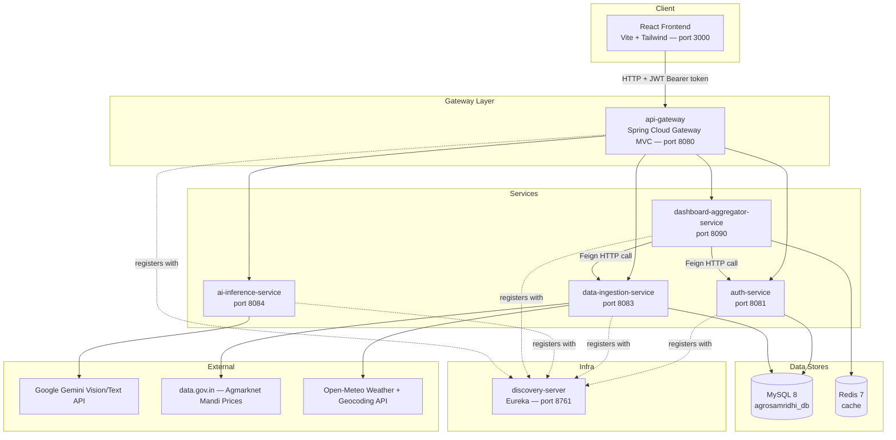

# AgroSamridhi Platform — Complete Project Documentation

> A single reference document explaining what AgroSamridhi is, how its pieces fit together, the technology behind every module, and how data flows end‑to‑end — written so someone with no prior context on this repo can understand it from the ground up.

**Last updated:** 2026‑07‑31

---

## Table of Contents

1. [What This Project Is](#1-what-this-project-is)
2. [High-Level Architecture](#2-high-level-architecture)
3. [Core Concepts, Explained from Basics](#3-core-concepts-explained-from-basics)
4. [Technology Stack at a Glance](#4-technology-stack-at-a-glance)
5. [Module Deep Dive](#5-module-deep-dive)
   - [5.1 discovery-server](#51-discovery-server)
   - [5.2 api-gateway](#52-api-gateway)
   - [5.3 auth-service](#53-auth-service)
   - [5.4 data-ingestion-service](#54-data-ingestion-service)
   - [5.5 ai-inference-service](#55-ai-inference-service)
   - [5.6 dashboard-aggregator-service](#56-dashboard-aggregator-service)
   - [5.7 frontend](#57-frontend)
6. [End-to-End Flows](#6-end-to-end-flows)
7. [Database Overview](#7-database-overview)
8. [Running the Project Locally](#8-running-the-project-locally)
9. [Known Gaps, Bugs & Technical Debt](#9-known-gaps-bugs--technical-debt)
10. [Suggested Next Steps](#10-suggested-next-steps)

---

## 1. What This Project Is

**AgroSamridhi** is an AI-assisted platform for Indian farmers. A farmer registers, builds a profile (location, land size, income, primary crop), and gets access to:

1. **Soil Health Card OCR** — upload a photo of a soil health card, get back Nitrogen/Phosphorus/Potassium/pH readings.
2. **AI Crop Suggestion** — given soil nutrients, budget, land size and season, get a 3-year crop rotation plan.
3. **Pest & Disease Diagnosis** — upload a photo of an ailing crop, get a diagnosis, severity, and organic/chemical remedies.
4. **Weather Advisory** — 7-day-style forecast and farming alerts, per district.
5. **Mandi (market) Price Intelligence** — live crop prices scraped from a government data source, plus price trend stats.
6. **Government Scheme Finder** — matches the farmer's profile against ~30 government welfare schemes and returns an eligibility score.
7. **Unified Dashboard** — one summary screen combining profile, weather, and mandi data.

The system is built as a **backend of 6 Spring Boot microservices** behind a single API gateway, plus a **separate React frontend** that talks only to the gateway.

---

## 2. High-Level Architecture



**How a request travels:** the frontend always talks to `http://localhost:8080` (the gateway). The gateway inspects the path prefix (`/api/auth/**`, `/api/ai/**`, `/api/mandi/**`, `/api/weather/**`, `/api/v1/dashboard/**`) and forwards it to the matching backend service, after validating the JWT itself (except for open routes like login/register). Each backend service also independently validates the same JWT again with its own copy of the secret. Services locate each other via the discovery server, though (as detailed in §9) the gateway's routes currently use hardcoded `localhost:PORT` URIs rather than Eureka-resolved addresses.

---

## 3. Core Concepts, Explained from Basics

If you're new to this style of architecture, these are the ideas the whole platform rests on.

**Microservices** — instead of one large application, the backend is split into six small, independently-deployable Spring Boot applications, each owning one slice of functionality (auth, AI, data ingestion, aggregation) and its own port. They communicate over HTTP, not by sharing code or a database schema owned by another service.

**Service discovery (Eureka)** — in a microservices world, service IP addresses/ports can change (e.g., in the cloud, containers get new IPs on restart). Instead of hardcoding "auth-service lives at 10.0.0.5:8081" everywhere, every service registers itself with a central registry (**Eureka**, running in `discovery-server`) under a logical name like `agro-auth-service`. Other services ask the registry "where is `agro-auth-service` right now?" instead of hardcoding an address. In this project, the registry is populated correctly, but (see §9) the gateway doesn't actually use it for routing yet — it still hardcodes `localhost:PORT`.

**API Gateway** — a single front door for all backend traffic. Clients (the frontend) only need to know one URL (`localhost:8080`). The gateway is responsible for routing requests to the right internal service based on URL path, and — in this project — for a first pass of JWT authentication before the request is even forwarded.

**JWT (JSON Web Token) authentication** — after a farmer logs in, the server issues a signed token (a JWT) containing their identity (email, farmer ID) and an expiry. The token is **not encrypted, only signed** — anyone can read its contents, but only the server (which holds the secret key) can produce a validly-signed one. The frontend stores this token and attaches it as `Authorization: Bearer <token>` on every subsequent request. Both the gateway and each backend service verify the signature with the shared secret before trusting the request's identity. This project uses **HMAC-SHA256 (HS256)** signing, which means the *same secret string* must be configured on every service that issues or validates tokens — there's no public/private key pair.

**OpenFeign (declarative HTTP clients)** — instead of manually building HTTP requests with something like `RestTemplate`, developers just write a Java `interface` with `@GetMapping` annotations describing another service's endpoints, and Spring generates the HTTP-calling code at runtime. `dashboard-aggregator-service` uses this to call `auth-service` and `data-ingestion-service`.

**Reactive programming (Spring WebFlux, `Mono`/`Flux`)** — the traditional Spring MVC style processes one request per thread and blocks that thread while waiting on I/O (like a slow AI API call). WebFlux instead represents "a value that will arrive later" as a `Mono<T>` (0 or 1 result) or `Flux<T>` (0..N results), and the framework can serve many concurrent requests without a thread per request. `ai-inference-service` uses this because it waits on slow, external Gemini API calls and handles image uploads.

**Redis caching** — an in-memory key-value store, much faster than a relational database, typically used to cache the result of an expensive or slow operation for a short time (a TTL, "time to live") so repeat requests don't have to redo the work. `dashboard-aggregator-service` is provisioned with Redis for exactly this purpose (see §9 for its current status).

**Docker Compose** — `docker-compose.yml` at the repo root declares the two shared infrastructure dependencies (MySQL and Redis) as containers, so any developer can `docker compose up` and get a working database/cache without installing them natively.

---

## 4. Technology Stack at a Glance

| Layer | Technology |
|---|---|
| Backend language/runtime | Java 17 (mostly), Spring Boot |
| Backend framework | Spring Boot 3.x (most services) / Spring Boot 4.1.0 (root parent, `discovery-server`) |
| Service discovery | Netflix Eureka (Spring Cloud) |
| API Gateway | Spring Cloud Gateway **MVC** (servlet-based, not the reactive Gateway) |
| Security / Auth | Spring Security 6, JWT (`io.jsonwebtoken` / jjwt 0.11.5), BCrypt password hashing |
| Reactive stack | Spring WebFlux (only in `ai-inference-service`; used for multipart uploads + non-blocking Gemini calls) |
| Inter-service calls | OpenFeign (`dashboard-aggregator-service` → other services) |
| Database | MySQL 8 (`agrosamridhi_db`), Hibernate/JPA, `ddl-auto=update` (no Flyway/Liquibase) |
| Cache | Redis 7 (provisioned, wiring incomplete — see §9) |
| AI | Google Gemini (`gemini-flash-latest`) via the raw REST `generateContent` API — no official Google SDK, hand-rolled `WebClient` calls |
| External data | Agmarknet / data.gov.in (mandi prices), Open-Meteo (weather + geocoding) |
| API docs | springdoc-openapi (Swagger UI) per service — **not aggregated** at the gateway |
| Frontend framework | React 19 (plain JSX, no TypeScript) |
| Frontend build tool | Vite 8 |
| Frontend routing | React Router v7 |
| Frontend styling | Tailwind CSS v4 (CSS-first config, no `tailwind.config.js`) |
| Frontend state | React Context (auth only) + local component state — no Redux/Zustand/React Query |
| Frontend HTTP | Axios, one shared client with request/response interceptors |
| Frontend extras | `recharts` (charts), `lucide-react` (icons), `react-hot-toast` (notifications), `oxlint` (linting) |
| Infra / local dev | Docker & Docker Compose (MySQL + Redis containers only — app services are run natively, not containerized) |

---

## 5. Module Deep Dive

### 5.1 `discovery-server`

**Purpose:** the Eureka service registry — the "phone book" every other service registers itself into.

- **Port:** `8761`
- **Key dependency:** `spring-cloud-starter-netflix-eureka-server`
- **Main class:** `DiscoveryServerApplication` — annotated `@EnableEurekaServer`, which is the one line that turns a plain Spring Boot app into a full Eureka registry (dashboard UI at `/`, REST registry endpoints under `/eureka/**`).
- **Configuration** (`application.properties`):
  - `eureka.client.registerWithEureka=false` and `eureka.client.fetchRegistry=false` — this node runs in **standalone mode**: it does not try to register itself as a client of another Eureka node, and does not attempt peer replication. Fine for local/single-instance development; would need clustering config for high availability.
  - `eureka.client.serviceUrl.defaultZone=http://localhost:8761/eureka/` — self-referential, standard single-node setup.
- **From basics:** every other service's `application.properties`/`.yml` points its `eureka.client.service-url.defaultZone` at this same URL, and (with `@EnableDiscoveryClient` on their own main classes) periodically sends heartbeats here. If you open `http://localhost:8761` in a browser while everything is running, you'll see a live list of registered instances — this is the fastest way to check "is my service actually up and known to the rest of the system?"

### 5.2 `api-gateway`

**Purpose:** the single entry point for all client traffic; routes requests to the correct backend service and performs a first-pass JWT check.

- **Port:** `8080`
- **Framework note:** uses **Spring Cloud Gateway MVC** — the newer servlet-based (not reactive/WebFlux) flavor of Spring Cloud Gateway. This matters because its cross-cutting concerns (auth, CORS) are implemented as ordinary servlet `Filter`s (`OncePerRequestFilter`, `WebMvcConfigurer`), the same patterns used in any traditional Spring MVC app — not reactive `GlobalFilter`s.
- **Routing** (`application.properties`), four explicit routes:

  | Route id | Path predicate | Forwards to |
  |---|---|---|
  | `auth-service` | `/api/auth/**`, `/api/schemes/**` | `http://localhost:8081` |
  | `data-ingestion-service` | `/api/mandi/**`, `/api/weather/**` | `http://localhost:8083` |
  | `ai-inference-service` | `/api/ai/**` | `http://localhost:8084` |
  | `dashboard-aggregator-service` | `/api/v1/dashboard/**` | `http://localhost:8090` |

  `spring.cloud.gateway.discovery.locator.enabled=true` is also set, which *would* auto-create additional routes from whatever's currently registered in Eureka — but the four routes above are hardcoded static URIs rather than Eureka-resolved `lb://SERVICE-NAME` addresses, so Eureka isn't actually driving the routing decisions today (see §9).

- **Authentication** — `filter/AuthenticationFilter.java`, a servlet filter applied globally:
  1. Lets `OPTIONS` (CORS preflight) requests through unfiltered.
  2. Maintains an allowlist of open path substrings (`/api/auth/login`, `/api/auth/register`, `/api/schemes`, `/actuator/health`) that skip auth entirely.
  3. For everything else, requires `Authorization: Bearer <token>`; missing header → `401`.
  4. Validates the token's signature/expiry using its own `JwtUtil` (same HS256 secret as `auth-service`); invalid → `401`.
  5. On success, simply lets the request continue to the routed service — it does **not** forward decoded claims (like farmer ID) as headers, so each downstream service must independently re-parse the same JWT from the original header to know who's calling.
- **CORS** (`config/CorsConfig.java`): allows origins `http://localhost:4200` and `http://localhost:3000` (the frontend's dev port), methods `GET/POST/PUT/DELETE/OPTIONS`, all headers, `maxAge=3600`.
- **No Swagger aggregation** exists here — there's no `springdoc` dependency in this module, so there is no single combined Swagger UI at the gateway despite the root `Readme.md` describing one.

### 5.3 `auth-service`

**Purpose:** farmer identity — registration, login, profile, and government scheme eligibility matching.

- **Port:** `8081`
- **Database table:** `farmers` (MySQL, via JPA/Hibernate)

#### Data model
`Farmer` entity — one row per registered user. Fields: `farmerId` (PK), `name`, `email` (unique), `phone`, `password` (BCrypt hash), `state`, `district`, `landSizeAcres`, `annualIncome`, `primaryCrop`, `casteCategory` (enum: `GEN`/`OBC`/`SC`/`ST`/`GENERAL`), `preferredLanguage` (enum: `EN`/`HI`/`MR`), `latitude`/`longitude`, `createAt`. There's no separate `User`/`Role` table — the farmer record *is* the account, and everyone gets one hardcoded authority (`ROLE_FARMER`) at authentication time; there's no admin/officer role tier.

#### Endpoints

| Method | Path | Auth | What it does |
|---|---|---|---|
| POST | `/api/auth/register` | open | Validates input, rejects duplicate email/phone, BCrypt-hashes the password, saves the farmer, issues a JWT, returns it with basic profile fields |
| POST | `/api/auth/login` | open | Looks up by email, verifies password with BCrypt, issues a JWT |
| GET | `/api/auth/profile` | requires valid JWT (`FARMER` role) | Returns the *caller's own* profile, resolved from the JWT's embedded farmer ID |
| GET | `/api/auth/profile/{id}` | requires valid JWT | Returns *any* farmer's profile by ID — used internally by `dashboard-aggregator-service`'s Feign client |
| GET | `/api/schemes/match` | requires `FARMER` role | Returns schemes matched against the caller's own profile, each with an eligibility score |
| GET | `/api/schemes/all` | requires `FARMER` role | Returns all ~30 known schemes, unfiltered |

#### Security mechanics
Password hashing uses `BCryptPasswordEncoder` at strength 12. A custom servlet filter (`JwtFilter`) reads the `Authorization` header, validates the token via `JwtUtil` (HS256, `Jwts.parserBuilder()`), and if valid, manually builds a Spring Security `Authentication` object carrying the farmer's email as principal and farmer ID as credentials, with the single authority `ROLE_FARMER`. There's no `UserDetailsService`/`AuthenticationManager` — authentication is entirely custom-built around the JWT filter rather than Spring Security's standard login machinery (which makes sense, since there's no server-side session — login only ever produces a token).

#### Government Scheme eligibility engine (the interesting part)
`schemes.json` (bundled as a static resource) holds ~30 scheme definitions, each with eligibility criteria: max land size, min/max income, allowed caste categories, allowed states, and whether a bank account/Aadhaar is required. `SchemeService` loads this file once at startup into memory (no database table for schemes).

For each scheme, `evaluateEligibility()`:
1. **Hard gate:** if the scheme restricts to specific states and the farmer's state isn't one of them, the score is immediately `0` — no partial credit.
2. Otherwise, it computes a **weighted percentage score** across whichever criteria the scheme actually restricts on (a criterion with a "no restriction" sentinel value doesn't count toward the total at all): land size ceiling, income floor/ceiling, and caste category. Missing farmer data (e.g., null caste) is treated leniently — the farmer gets credit rather than being penalized for an unset field.
3. Bank-account/Aadhaar requirements are always assumed satisfied (there's no actual verification against a farmer field for these).
4. A scheme only appears in `/api/schemes/match` results if its score is **≥ 70**.

The output (`SchemeMatchResult`) includes the score plus human-readable "matched" and "unmatched" reason strings, so the frontend can show farmers *why* they qualify or don't.

### 5.4 `data-ingestion-service`

**Purpose:** pulls in two categories of external, time-sensitive data — weather and mandi (market) prices — on a schedule, stores them, and serves them back through simple REST endpoints.

- **Port:** `8083`
- **Reactive `WebClient`, used synchronously:** this service depends on `spring-boot-starter-webflux` purely to get access to the modern `WebClient` HTTP client for calling third-party APIs — but every call is immediately `.block()`ed, so in practice it behaves like a normal blocking service, not a reactive one.

#### Scheduled jobs
- **`MandiScheduler`** — cron `0 30 */6 * * *` (every 6 hours, at :30). Calls the Agmarknet resource API (`data.gov.in`) for the latest 100 records, parses each into a `MandiPrice` row (crop, mandi, district, state, min/max/modal price, arrival date), and **deduplicates** by checking (crop, mandi, date) before inserting.
- **`WeatherScheduler`** — cron `0 0 */6 * * *` (every 6 hours, on the hour). Calls Open-Meteo's forecast API for one hardcoded default location (Mumbai, lat 19.076/lon 72.877) and inserts a fresh `WeatherData` row every run — no dedup, and no automatic multi-district refresh (other districts only get data if someone manually calls the fetch endpoint for them).

#### Endpoints

| Method | Path | Notes |
|---|---|---|
| GET | `/api/mandi/all` | all stored mandi price rows |
| POST | `/api/mandi/fetch` | manually re-triggers the same ingestion the scheduler runs |
| GET | `/api/mandi/trends?cropName=` | average/min/max modal price + record count for a crop — computed in Java over **all** matching rows (see §9: this is not actually windowed to 90 days despite the product description) |
| POST | `/api/weather/fetch?district=` | fetches & stores current weather for a district (geocodes the name via Open-Meteo first if given), or the default location if omitted |
| GET | `/api/weather/all` | all stored weather rows |
| GET | `/api/weather/advisory?district=` | free-text advisory string |
| GET | `/api/weather/current?district=` | most recent weather row for a district |

Both external integrations (Agmarknet, Open-Meteo) are called via plain string-concatenated URLs with an API key/coordinates as query parameters — there's no retry, circuit breaker, or request-level timeout configured; a slow/failing external API surfaces as a generic error via a basic `GlobalExceptionHandler`.

### 5.5 `ai-inference-service`

**Purpose:** everything that calls Google Gemini — soil health card OCR, pest/disease diagnosis from crop photos, and AI-assisted crop rotation planning.

- **Port:** `8084`
- **Framework note:** this is the one service genuinely built reactively end-to-end (WebFlux, no servlet/Tomcat starter at all) — appropriate given it handles multipart image uploads and calls a slow external AI API.
- **Gemini integration:** there is no Google SDK dependency — `GeminiClient` builds the request body as a plain `Map` (`contents[].parts[]`, with an inline base64 image part when needed) and posts it directly to `https://generativelanguage.googleapis.com/v1beta/models/gemini-flash-latest:generateContent?key=<API_KEY>`. The API key comes purely from the `GEMINI_API_KEY` environment variable.

#### Endpoints

| Method | Path | Body | Returns |
|---|---|---|---|
| POST | `/api/ai/soil-ocr` | multipart image | `{ nitrogen, phosphorus, potassium, ph }` (or `rawText` fallback if Gemini's JSON couldn't be parsed) |
| POST | `/api/ai/pest-diagnosis` | multipart image | `{ cropName, diseaseName, severity, symptoms[], organicRemedies[], chemicalRemedies[], preventiveMeasures[] }` |
| POST | `/api/ai/crop-suggestions` | JSON: `{ nitrogen, phosphorus, potassium, ph, budget, location, farmSizeAcres, season }` | `{ eligibleCrops[], rotationPlan[], advisory }` |

#### How images are handled
Each upload is bound reactively as a `FilePart` (no blocking `MultipartFile`), joined into a single in-memory buffer (capped at 10 MB via `spring.codec.max-in-memory-size`), then Base64-encoded and embedded directly into the Gemini request JSON — Gemini's `generateContent` API expects the whole image inline in one request, so there's no true streaming benefit here beyond non-blocking I/O while waiting on the network.

#### Prompt engineering pattern
All three Gemini prompts follow the same shape: assign Gemini a domain expert persona ("expert at reading Indian Soil Health Cards" / "expert Indian agricultural pathologist"), specify the exact JSON fields wanted, and explicitly instruct "return ONLY a valid JSON object, no markdown, no code fences." Because LLMs don't always obey that instruction perfectly, each service then defensively extracts the substring between the first `{` and last `}` in the raw response before handing it to Jackson — this strips any stray prose or markdown fences the model still emitted.

#### The crop-suggestion "rule engine + LLM" design
This is the most architecturally interesting piece in the AI service. `CropRuleEngine` holds a small hardcoded database of 11 crops across India's three cropping seasons (Kharif/Rabi/Zaid), each with a pH range and an approximate cost per acre. Given a request, it deterministically filters this list down to only the crops that match the requested season, fall within the soil's pH range, and fit within the stated budget — **no AI involved in this step**. That filtered list is then **injected into the Gemini prompt as a hard constraint** ("you MUST only choose crops from this pre-approved eligible list"), and Gemini is only asked to do the part LLMs are actually good at: sequencing those pre-approved crops into a sensible 3-year rotation (for soil-health/crop-family diversity) and writing the cost/profit narrative and advisory text. This means Gemini can never recommend an agronomically invalid or unaffordable crop — the rule engine acts as a deterministic safety rail around the LLM's more creative reasoning.

#### Failure behavior
Transport-level failures (Gemini API returns an error status) surface as a generic `500`. Parse failures (Gemini's text wasn't valid/parseable JSON) are caught locally and degrade gracefully to a `200 OK` with all typed fields `null` and a `rawText` field carrying Gemini's raw answer — so callers need to handle two different failure shapes for what is conceptually the same failure mode (a bad Gemini response).

### 5.6 `dashboard-aggregator-service`

**Purpose:** the "one screen" experience — pulls together profile, weather, and mandi data from other services into a single response for the frontend's dashboard.

- **Port:** `8090`
- **Single endpoint:** `GET /api/v1/dashboard/{farmerId}`

#### How aggregation works
`DashboardAggregatorService.getAggregatedDashboard(farmerId)` runs three calls **sequentially** (not in parallel — there's no `@Async`/`CompletableFuture` anywhere in this module):
1. `AuthServiceClient.getProfile(farmerId)` (Feign → `auth-service`'s `/api/auth/profile/{id}`) — **not** wrapped in try/catch, so if this fails, the whole dashboard request fails.
2. If the profile has a resolvable district/state, fetches weather advisory + current weather from `data-ingestion-service` — each in its own try/catch, so a weather outage doesn't blank the whole dashboard.
3. If the profile has a primary crop, fetches mandi trends for it — also independently try/caught.
4. Combines everything into one `UnifiedDashboardResponse { profile, weather, mandiTrends, timestamp }`.

Both Feign clients (`AuthServiceClient`, `DataIngestionClient`) share a `FeignClientInterceptor` that forwards the original inbound `Authorization` header onto every outbound call, so the downstream services see the same farmer's JWT and can enforce their own auth rules consistently.

#### Redis caching — provisioned but currently unused
`RedisCacheConfig` defines `@EnableCaching` and a 10-minute-TTL `RedisCacheConfiguration` bean, and the Redis dependency/connection config is all present. However, **no `@Cacheable` annotation currently exists anywhere in the codebase** — an earlier version had one on `getAggregatedDashboard`, but it was removed during a bug-fix pass (see §9) and never restored. This means the module's stated design goal (serving the dashboard in under 500ms via caching) is not actually cache-backed today; every request round-trips live to both downstream services.

### 5.7 `frontend`

**Purpose:** the farmer-facing web client. A single-page React app that talks exclusively to the API gateway.

- **Stack:** React 19 (plain JSX, no TypeScript) + Vite 8 + React Router v7 + Tailwind CSS v4 + Axios.
- **Dev port:** `3000`.

#### Structure
```
src/
├── api/        one axios-based module per backend domain (auth, ai, dashboard, mandi, schemes, weather)
├── components/ layout shell (Sidebar/Topbar/AppShell), route guard, small reusable UI primitives
├── context/    AuthContext — the app's only global state (current user + JWT)
├── pages/      one page per feature area, plus an ai/ subfolder for the three AI tools
```

#### Talking to the backend
A single shared Axios instance (`api/client.js`) is the only HTTP mechanism in the app:
- **Base URL** defaults to `http://localhost:8080` (the gateway), overridable via the Vite env var `VITE_API_BASE_URL` — though no `.env` file currently exists in the repo, so it always runs against the local gateway unless one is added.
- **Request interceptor** reads the JWT from `localStorage` and attaches `Authorization: Bearer <token>` to every outgoing request.
- **Response interceptor** watches for `401` responses; on any, it clears the stored token/user and redirects to `/login` — this is the app's entire session-expiry handling (there's no silent token refresh).

#### Auth flow
`Login`/`Register` pages call into `AuthContext`, which stores the returned JWT and profile fields under `agrosamridhi_token`/`agrosamridhi_user` in `localStorage`. `ProtectedRoute` wraps every authenticated page; if there's no token, it redirects to `/login` and remembers the originally-requested path so it can send the user back there after they log in.

#### Feature-to-page mapping
Every backend capability has a corresponding page and API module: `SoilOcr.jsx` / `CropSuggestion.jsx` / `PestDiagnosis.jsx` (under `pages/ai/`) call `ai-inference-service`'s endpoints; `Weather.jsx` and `Mandi.jsx` call `data-ingestion-service`; `Schemes.jsx` calls `auth-service`'s scheme endpoints; `Dashboard.jsx` calls the aggregator; `Profile.jsx` is read-only (there's no edit-profile flow yet).

---

## 6. End-to-End Flows

### 6.1 Register → Login → Authenticated Request
1. Frontend `POST /api/auth/register` (via gateway, open route) with the farmer's profile fields.
2. Gateway forwards to `auth-service`, which validates input, hashes the password (BCrypt), saves the `Farmer` row, and generates a JWT (HS256, 7-day expiry, containing email + farmer ID).
3. Frontend stores the token in `localStorage` and attaches it as `Authorization: Bearer <token>` from then on.
4. Every subsequent request passes through the gateway's `AuthenticationFilter` (validates signature/expiry) *and* the target service's own JWT filter (validates again, independently) before reaching business logic.

### 6.2 Soil OCR → Crop Suggestion (a real user journey)
1. Farmer uploads a soil health card photo on the **Soil OCR** page → `POST /api/ai/soil-ocr` → Gemini Vision extracts N/P/K/pH → returned to the frontend.
2. Frontend offers "use these values in Crop Suggestion," navigating to the **Crop Suggestion** page with those nutrient values pre-filled.
3. Farmer adds budget, land size, location, and season, and submits → `POST /api/ai/crop-suggestions`.
4. `ai-inference-service`'s rule engine filters its crop database down to season/pH/budget-eligible crops first (deterministic), then asks Gemini to sequence those into a 3-year rotation plan with commentary (LLM), and returns both the eligible-crop list and the rotation plan together.

### 6.3 Dashboard Load
1. Frontend calls `GET /api/v1/dashboard/{farmerId}` through the gateway.
2. `dashboard-aggregator-service` fetches the farmer's profile from `auth-service` (Feign, propagating the original JWT), then — using the profile's district and primary crop — fetches weather and mandi data from `data-ingestion-service` in two more Feign calls (currently sequential, not parallel; currently not cached).
3. Everything is merged into one JSON payload the frontend renders as the dashboard's cards.

---

## 7. Database Overview

Single shared MySQL database: `agrosamridhi_db` (container `agrosamridhi-db`, port `3306`). Schema is managed purely by Hibernate's `ddl-auto=update` — **there is no Flyway/Liquibase migration tooling and no `.sql` migration files anywhere in the repo.**

| Table | Owning service | Key columns |
|---|---|---|
| `farmers` | auth-service | `farmer_id` (PK), `email` (unique), `password` (BCrypt hash), `state`, `district`, `land_size_acres`, `annual_income`, `primary_crop`, `caste_category`, `preferred_language`, `latitude`, `longitude` |
| `mandi_price` | data-ingestion-service | `id` (PK), `crop_name`, `mandi_name`, `district`, `state`, `min_price`, `max_price`, `modal_price`, `arrival_date` |
| `weather_data` | data-ingestion-service | `id` (PK), `district`, `state`, `latitude`, `longitude`, `temperature`, `humidity`, `rainfall`, `wind_speed`, `forecast_date` |

Government schemes are **not** in the database at all — they live as a static `schemes.json` resource loaded into memory by `auth-service` at startup.

Redis (`agrosamridhi-cache`, port `6379`) is provisioned for `dashboard-aggregator-service` but not actually populated by any code path yet (see §9).

---

## 8. Running the Project Locally

1. **Start shared infrastructure:**
   ```bash
   docker compose up -d
   ```
   This brings up MySQL (port 3306, db `agrosamridhi_db`, user `root`/`rootpassword`) and Redis (port 6379). The app services themselves are **not** containerized — they're run natively.

2. **Start the discovery server first** (everything else registers with it):
   ```bash
   cd discovery-server && ./mvnw spring-boot:run
   ```
   Confirm it's up at `http://localhost:8761`.

3. **Start the remaining backend services** (order doesn't strictly matter once discovery-server is up, but the gateway is most useful once the others are registered):
   ```bash
   cd auth-service && ./mvnw spring-boot:run                       # :8081
   cd data-ingestion-service && ./mvnw spring-boot:run              # :8083
   cd ai-inference-service && GEMINI_API_KEY=<your-key> ./mvnw spring-boot:run   # :8084
   cd dashboard-aggregator-service && ./mvnw spring-boot:run        # :8090
   cd api-gateway && ./mvnw spring-boot:run                         # :8080
   ```
   Note `ai-inference-service` **requires** `GEMINI_API_KEY` to be set — there's no hardcoded fallback for it (unlike the JWT secret, which does have a dev default baked in).

4. **Start the frontend:**
   ```bash
   cd frontend && npm install && npm run dev   # :3000
   ```

5. Visit `http://localhost:3000`, register a farmer account, and explore. Each service also exposes its own Swagger UI at `http://localhost:<port>/swagger-ui.html` (auth-service and api-gateway do not have springdoc configured, so this only applies to `data-ingestion-service`, `ai-inference-service`, and `dashboard-aggregator-service`).

---

## 9. Known Gaps, Bugs & Technical Debt

Documenting these honestly is more useful than pretending the system is flawless — this is the punch list for hardening the platform.

**Security**
- Default JWT secret (`agro_auth_super_secret_key_minimum_256_bits_long_abc123xyz456`) is checked into source in both `auth-service` and `api-gateway`, only overridden if the `JWT_SECRET` env var is set — fine for local dev, must be overridden for any real deployment.
- `AuthService` logs the **full JWT** at INFO level on every register/login — a token in a log file is a token an attacker can replay.
- `GET /api/auth/profile/{id}` in `auth-service` has no ownership check — any authenticated farmer can fetch *any other* farmer's full profile by simply changing the ID (an IDOR vulnerability). It's also used internally by the dashboard aggregator, so tightening it needs a service-to-service auth story (e.g., a separate internal-only credential) rather than just adding a "must match caller" check.
- `/api/auth/profile` and `/api/auth/profile/{id}` return the raw JPA `Farmer` entity rather than a DTO — the BCrypt password hash field has no `@JsonIgnore` and would serialize into the JSON response.
- DB credentials and the Agmarknet API key are hardcoded in plaintext in `application.properties` files (no env-var externalization, no secrets vault).

**Correctness / design gaps vs. stated goals**
- The "90-day mandi price trend" is not actually windowed by date anywhere — `MandiServiceImpl.getPriceTrend()` averages **all** historical rows matching the crop name, with no `arrivalDate` range filter.
- The dashboard's "<500ms via Redis caching" goal isn't currently met — the `@Cacheable` annotation that used to back it was removed during a refactor and never reinstated, even though the Redis config/dependency is still fully wired.
- The dashboard aggregator doesn't call `ai-inference-service` at all — despite the module's role as a unifying layer, AI features (soil OCR, pest diagnosis, crop suggestions) aren't part of the aggregated summary.
- `api-gateway`'s routes hardcode `http://localhost:PORT` rather than Eureka-resolved `lb://SERVICE-NAME` addresses, so service discovery isn't actually driving routing yet — it would need manual route updates if a service's port or host ever changed.
- Weather auto-refresh only covers one hardcoded default district (Mumbai); every other district needs a manual fetch call to have any data at all.

**Build / consistency**
- Spring Boot/Cloud versions are inconsistent across modules: the root parent pins Boot 4.1.0 / Cloud 2025.1.2, but `api-gateway` deliberately overrides to Boot 3.2.5 / Cloud 2023.0.1 (with a code comment calling the 4.1.0 parent "broken"), while `discovery-server` stays on the parent's 4.1.0. Worth consolidating onto one Boot generation across all modules.
- No Flyway/Liquibase — schema evolves only via Hibernate `ddl-auto=update`, which is fine for a solo/small project but risky as more people touch the schema.

**Minor cleanup opportunities**
- Several dead/no-op bits of code: `SchemeMatchResult`'s flat `name`/`benefit`/`applyLink` fields are never populated (data lives nested under `scheme` instead); `@Cacheable("schemesList")` in `auth-service`'s `SchemeService` has no effect because `@EnableCaching` was never added there; `dashboard-aggregator-service`'s `DownstreamServiceException` is an empty unused class; `data-ingestion-service` has an empty `WebClientConfig` stub and an unused `CurrentWeather` DTO duplicate.
- No automated test suites exist for `dashboard-aggregator-service` or `ai-inference-service`.
- No global `@ControllerAdvice` exception handler in `auth-service`, `api-gateway`, or `ai-inference-service` — error responses are a mix of Spring Boot defaults and ad-hoc `ResponseStatusException`/try-catch patterns, so error response shapes aren't consistent across the platform.

---

## 10. Suggested Next Steps

Roughly in order of impact-to-effort:

1. **Re-add dashboard caching** (`@Cacheable` on `getAggregatedDashboard`, keyed by `farmerId`) — the infrastructure is already there; this alone would deliver the stated performance goal.
2. **Fix the profile IDOR** and stop returning the raw `Farmer` entity from auth endpoints — introduce a `FarmerProfileDTO` (the aggregator already has one shaped correctly) and add a proper internal-service-auth mechanism for the `/profile/{id}` lookup used by the aggregator.
3. **Move the gateway to Eureka-resolved (`lb://`) routing** instead of hardcoded ports, so services can move/scale without editing gateway config.
4. **Add a real 90-day window to the mandi trend query** (a simple `arrivalDate >= :cutoff` filter would do it).
5. **Consolidate Spring Boot/Cloud versions** across all six modules onto one generation to remove the current version drift.
6. **Wire `ai-inference-service` into the dashboard aggregator** if a "everything in one place" summary is still the goal for Module 8.
7. Externalize secrets (`JWT_SECRET`, DB password, Agmarknet API key) via environment variables/`.env` consistently, and stop logging JWTs.
